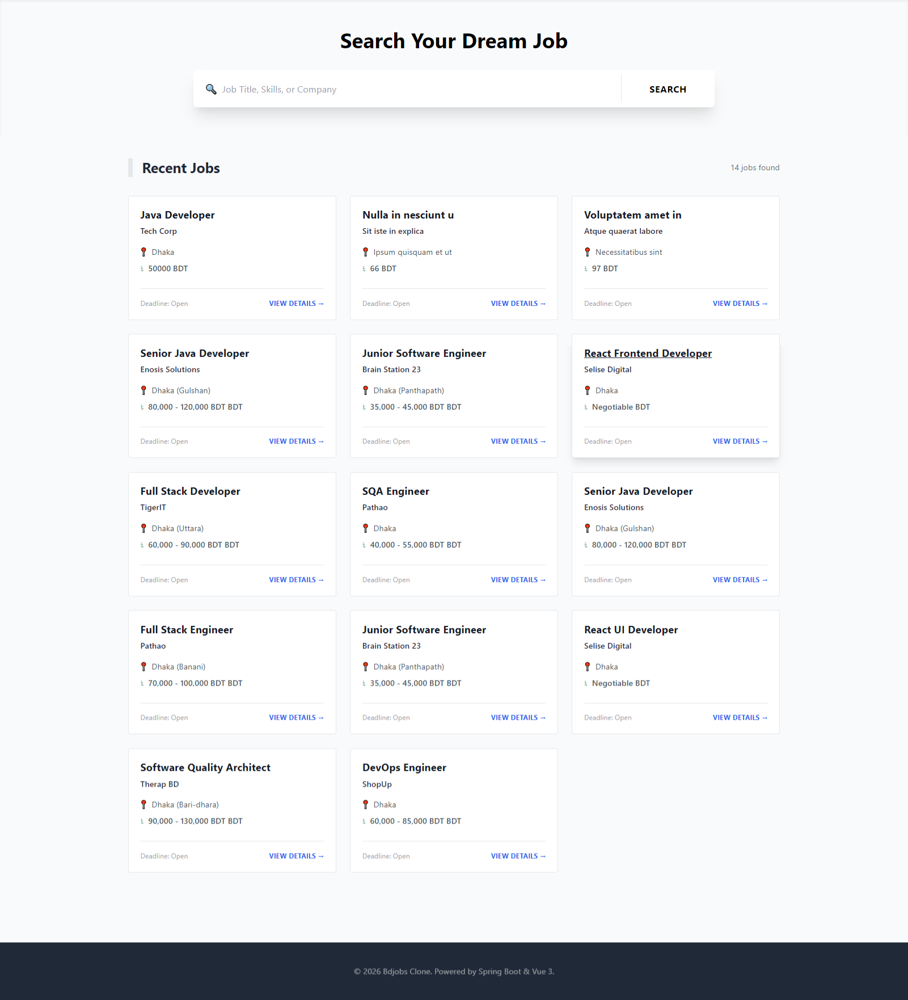
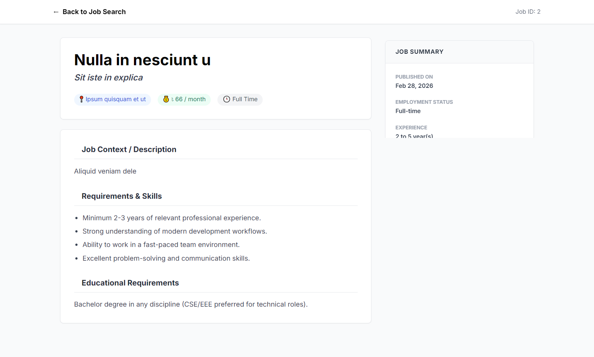
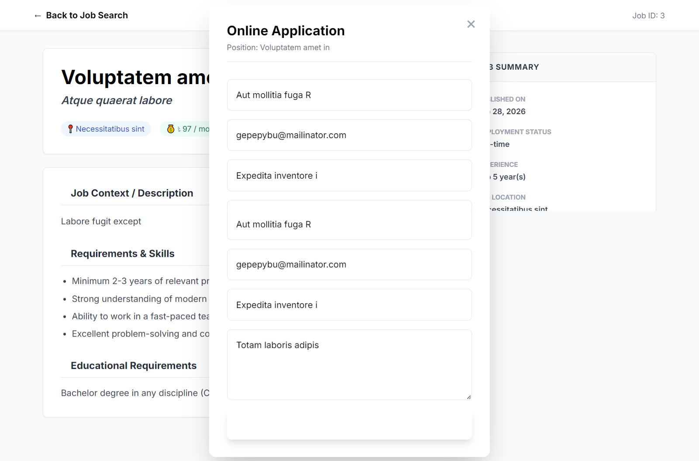
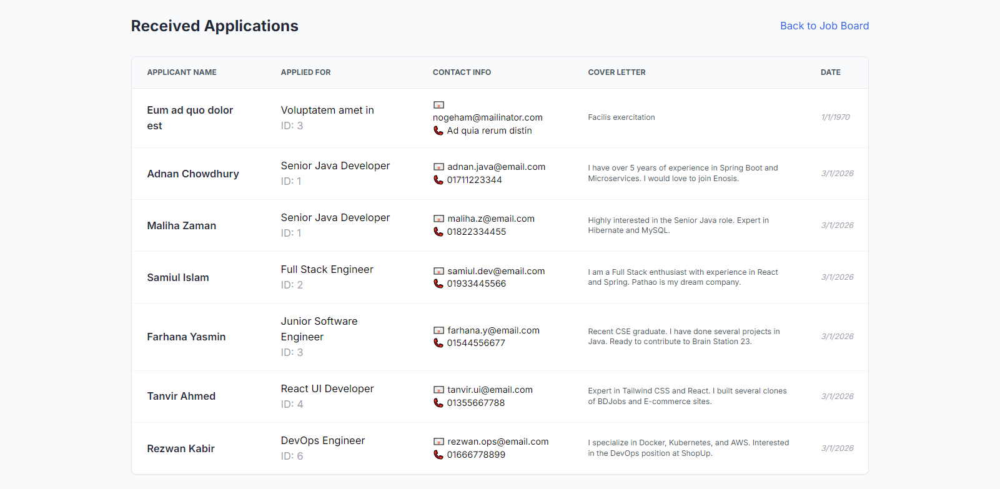

# 💼 JAVAJobs Portal -- Full Stack Application

A full-stack job portal clone inspired by **JAVAJobs**, built using
**Spring Boot (Backend)** and **Vue 3 (Frontend)**.

------------------------------------------------------------------------

## 🚀 Features

-   **Job Management** -- Create, Read, Update, and Delete job postings\
-   **Job Applications** -- Users can apply with their details and cover
    letters\
-   **Admin View** -- View all incoming job applications\
-   **Responsive UI** -- Clean, modern interface styled with Tailwind
    CSS

------------------------------------------------------------------------

## 🛠️ Tech Stack

### 🔹 Backend

-   Java 17+
-   Spring Boot 3.x
-   Spring Data JPA (Hibernate)
-   MySQL
-   Lombok

### 🔹 Frontend

-   Vue 3 (Composition API)
-   Vue Router
-   Tailwind CSS
-   Lucide Icons

------------------------------------------------------------------------

## ⚙️ Backend Setup (`myjobs-backend`)

### 1️⃣ Database Configuration

Create a MySQL database named:

``` sql
myjob_portal
```

### 2️⃣ Configure `application.properties`

``` properties
spring.datasource.url=jdbc:mysql://localhost:3306/myjob_portal
spring.datasource.username=root
spring.datasource.password=your_password
spring.jpa.hibernate.ddl-auto=update
```

### 3️⃣ Run the Application

Using Maven:

``` bash
mvn spring-boot:run
```

The backend API will run at:

    http://localhost:8080

------------------------------------------------------------------------

## 💻 Frontend Setup (`myjobs-frontend`)

### 1️⃣ Install Dependencies

``` bash
npm install
```

### 2️⃣ Run Development Server

``` bash
npm run dev
```

The frontend will run at:

    http://localhost:5173

------------------------------------------------------------------------

## 📡 API Endpoints

### 📌 Jobs

  Method   Endpoint           Description
  -------- ------------------ ---------------------------
  GET      `/api/jobs`        Retrieve all job postings
  GET      `/api/jobs/{id}`   Retrieve a specific job
  POST     `/api/jobs`        Create a new job
  PUT      `/api/jobs/{id}`   Update an existing job
  DELETE   `/api/jobs/{id}`   Remove a job

------------------------------------------------------------------------

### 📌 Applications

  Method   Endpoint              Description
  -------- --------------------- -----------------------------------------
  POST     `/api/applications`   Submit a new job application
  GET      `/api/applications`   View all submitted applications (Admin)

------------------------------------------------------------------------

## 📁 Project Structure

    ├── myjobs-backend
    │   └── src/main/java/com/abdullah/myjobs_backend
    │       ├── controller/   # REST Controllers (Job, Application)
    │       ├── entity/       # JPA Entities (JobPost, JobApplication)
    │       └── repository/   # Data Access Interfaces
    └── myjobs-frontend
        ├── src
        │   ├── views/        # Page components (Home, Details, Admin)
        │   └── router/       # Navigation logic
        └── index.html        # Main entry point

------------------------------------------------------------------------

---

## 📸 Screenshots

### 🏠 Home Page


### 📄 Job Details Page


### 📝 Job Application Form


### 🛠️ Admin Dashboard


---


## 📝 Troubleshooting

### ❌ CORS Error

Ensure this annotation is present on all controllers:

``` java
@CrossOrigin(origins = "*")
```

------------------------------------------------------------------------

### ❌ 405 Method Not Allowed

Restart the Spring Boot server after adding new `@GetMapping` or
`@PostMapping` methods.

------------------------------------------------------------------------

### ❌ Table Not Found

Ensure this property is set correctly:

``` properties
spring.jpa.hibernate.ddl-auto=update
```
